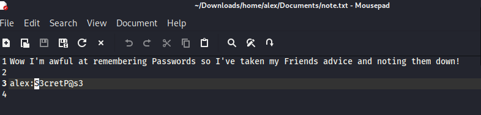
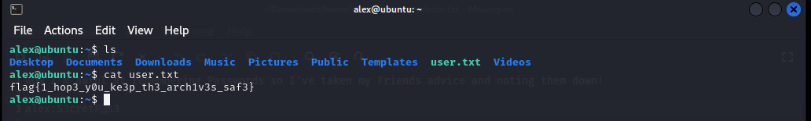

## Challenge Name: THM_Cyborg


Challenge Description:
A box involving encrypted archives, source code analysis and more.

Artifact Files:


### Approach

**1. Scan the machine, how many ports are open?**
Using `rustscan`  to scan port on target machine. Those open ports are 22,80.


**2 What service is running on port 22?**

SSH


**3 What is the user.txt flag? flag1**

I use ` disearch <IP>' to find hidden url of the website and it have  noticeable path like /admin /etc

Access admin site we have can dowload a archives file


After that we extract the archives file and know in readme part it use borg to compress the file.
Content of README : "See https://borgbackup.readthedocs.io/"
and in the etc part we have the etc/squid/passwd that has music_archive:$apr1$BpZ.Q.1m$F0qqPwHSOG50URuOVQTTn. it use apache hash and user name of that archive

Install borg and use `borg list` to detect the archive folder and `borg extract:<user_name>` to extract the data and we find the find that have ssh access credentials is /alex/Documents/note.txt




After that acces the machine using ssh alex:S3cretP@s3 get in and we have user.txt that cotain the flag1 `flag{1_hop3_y0u_ke3p_th3_arch1v3s_saf3}`

**3 What is the root.txt flag? flag2**
In the shell we use `sudo -l` t list what command we can run as root and we have `(ALL : ALL) NOPASSWD: /etc/mp3backups/backup.sh`

After read the script there is speacial code in that
```bash
while getopts c: flag
do
        case "${flag}" in
                c) command=${OPTARG};;
        esac
done
......
......
cmd=$($command)
echo $cmd
```
That code allow we to inject the to flag  of the script and excute it so the exploit could be 'sudo /etc/mp3backups/backup.sh -c "sudo cat  /root/root.txt"'


So we have the flag2 from root.txt and the flag is `flag{Than5s_f0r_play1ng_H0p£_y0u_enJ053d}`
