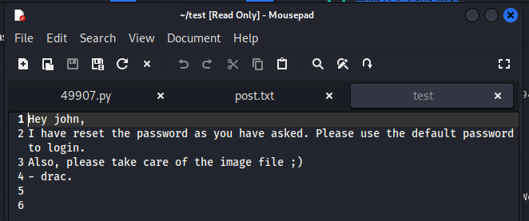
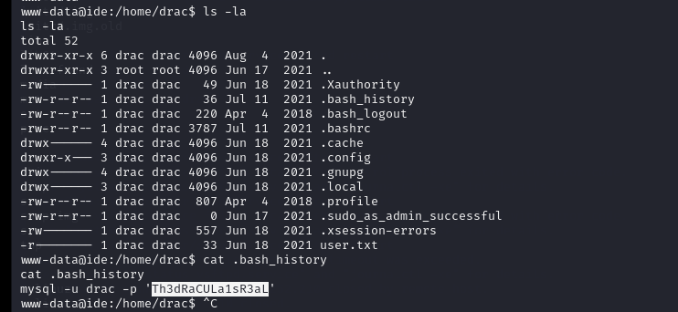
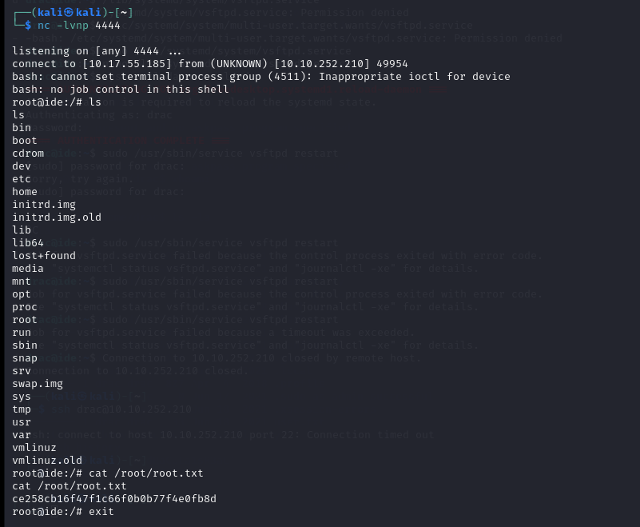

## Challenge Name: THM_IDE


Challenge Description:
An easy box to polish your enumeration skills!

Artifact Files:


### Approach
## Recon
Using `rustscan`  to scan port on target machine. Those open ports are 21,22,80,62337.


I use ` dirsearch <IP>' to find hidden url of the website and it have  nothing so accces the web through port 62337 and i get login form


Access ftp with anonymous account and found the file with this content


That mean user using the default username and password for app codiad 2.8.4 an it also have a exploit
[exploit_link](https://www.exploit-db.com/exploits/49705)

Base on that and some testting with some common password i have credentials of that app is john:password.
Using exploit and get the webshell.
Get in the webshell go to 'drac/home' folder and check what we can read.

We find out that we can read bash_history.Read that and we can use that for ssh acess and succes.

**1 What is the user.txt flag? flag1**

We simply  just `cat /home/drac/user.txt` and get the flag1 `02930d21a8eb009f6d26361b2d24a466`

**2 What is the root.txt flag? flag2**
In this problem we use `sudo -l` to list attack vector and we found
```bash
sudo -l

(ALL : ALL) /usr/sbin/service vsftpd restart
```
We using the [exploit_link](https://morgan-bin-bash.gitbook.io/linux-privilege-escalation/sudo-service-privilege-escalation) to get root acess.

Using reverse shell and use  `cat /root/root.txt` and we get the flag2 `ce258cb16f47f1c66f0b0b77f4e0fb8d`

