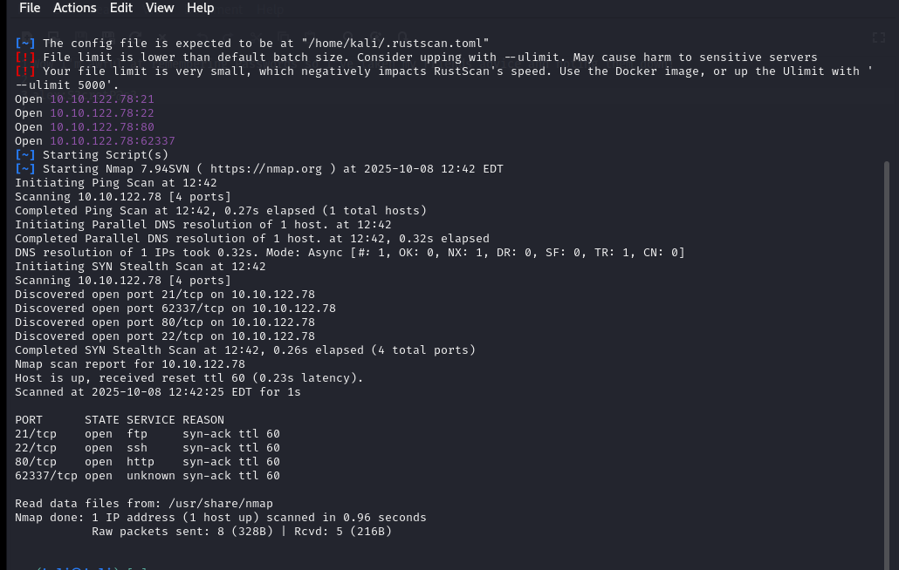
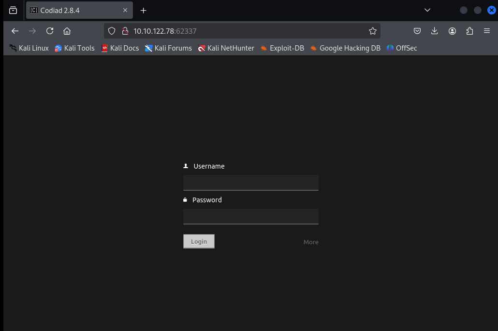
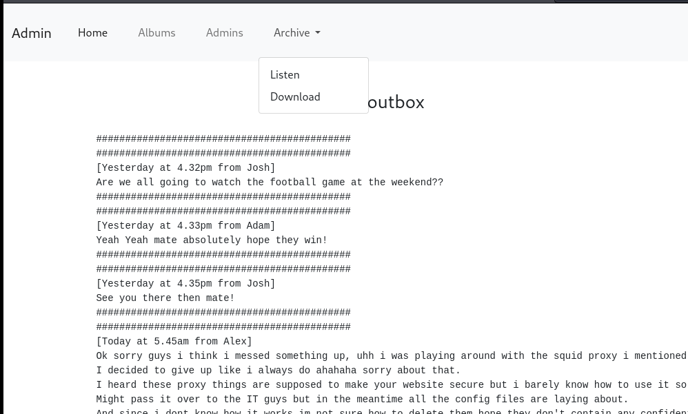
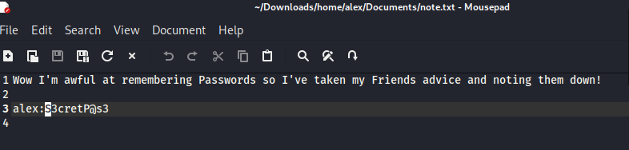

## Challenge Name: THM_IDE

Challenge Description:
An easy box to polish your enumeration skills!

Artifact Files:

### Approach
Using `rustscan`  to scan port on target machine. Those open ports are 21,22,80,62337.

I use ` disearch <IP>' to find hidden url of the website and it have  nothing so accces the web through port 62337 an i get login form

**1 What is the user.txt flag? flag1**

I use ` disearch <IP>' to find hidden url of the website and it have  noticeable path like /admin /etc

Access admin site we have can dowload a archives file

After that we extract the archives file and know in readme part it use borg to compress the file.
Content of README : "See https://borgbackup.readthedocs.io/"
and in the etc part we have the etc/squid/passwd that has music_archive:$apr1$BpZ.Q.1m$F0qqPwHSOG50URuOVQTTn. it use apache hash and user name of that archive

Install borg and use `borg list` to detect the archive folder and `borg extract:<user_name>` to extract the data and we find the find that have ssh access credentials is /alex/Documents/note.txt

After that acces the machine using ssh alex:S3cretP@s3 get in and we have user.txt that cotain the flag1 `flag{1_hop3_y0u_ke3p_th3_arch1v3s_saf3}`

**2 What is the root.txt flag? flag2**
